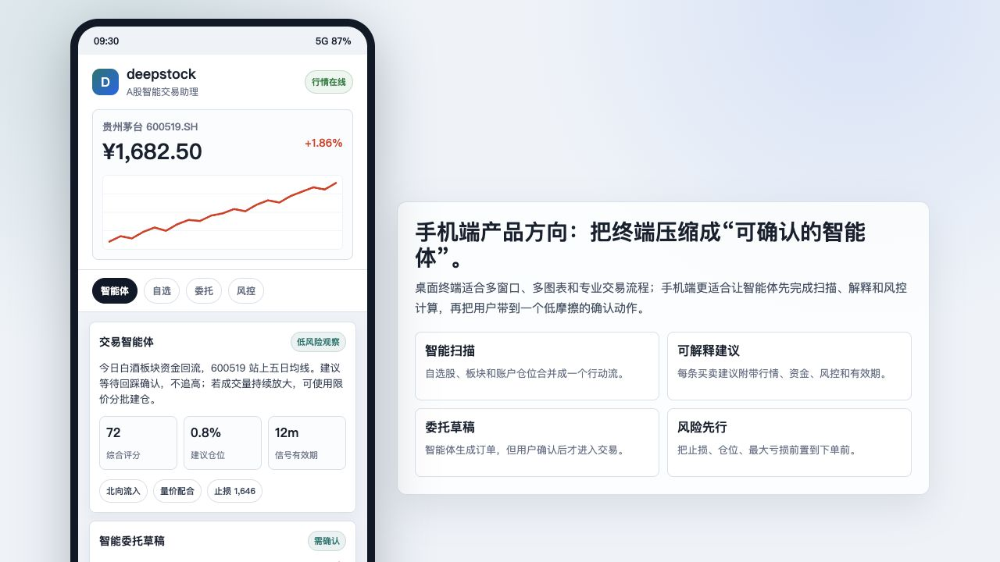
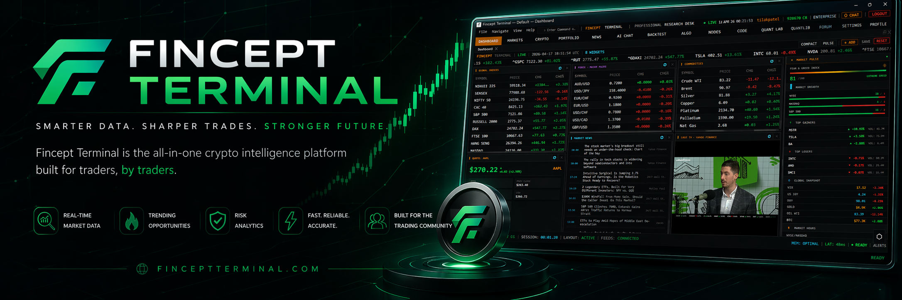
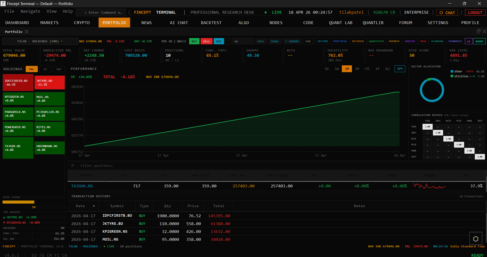

# deepstock.cn

`deepstock.cn` 是一个面向 A 股场景的交易终端 demo。项目基于原生 C++20、Qt6 和嵌入式 Python 构建，目标是把桌面级行情、研究、组合、风控和智能体工作流，压缩成一个适合中国股票市场的专业终端原型。

> 当前版本定位为产品 demo 与技术验证，不构成任何投资建议，也不应直接用于真实交易。

## 项目定位

deepstock.cn 希望探索两类产品形态：

- **桌面端交易终端**：适合多屏、多窗口、多图表、盘口、委托、组合管理和研究工作流。
- **手机端智能体助手**：适合将行情扫描、策略解释、风险计算和委托草稿压缩成一个可确认的智能体页面。

## 当前 Demo 能力

| 模块 | 说明 |
| --- | --- |
| A 股交易工作台 | 自选股、行情条、盘口深度、K 线区域、订单面板、持仓/资金/委托标签页 |
| 中文化前端 | 顶部导航、A 股交易入口、账户管理、批量下单、订单状态和组合导入流程已中文化 |
| deepstock 品牌化 | 构建目标、应用标题、打包元信息、Linux desktop/appdata、安装器组件改为 deepstock |
| 模拟交易 | 支持 paper trading 账户路径，适合演示委托生成和成交状态 |
| 移动端 demo | `mobile-demo/index.html` 提供 A 股智能交易助理的手机页面原型 |
| Python 数据能力 | 保留 AkShare、Yahoo Finance、研究、量化分析等脚本基础，便于继续接入 A 股数据源 |

## 界面预览

### 手机端智能体 Demo



### 桌面终端素材






## 快速体验手机端 Demo

```bash
cd mobile-demo
python3 -m http.server 4177
```

然后打开：

```text
http://127.0.0.1:4177/
```

这个页面展示了一个可交互的手机端智能体工作流：

- 查看核心标的行情与分时走势
- 获取智能体交易建议
- 查看信号评分、建议仓位、风险标签
- 生成模拟委托草稿
- 点击“解释依据”查看 AI 交易理由
- 点击“确认下单”进入模拟下单状态

## 桌面端构建

项目核心应用位于 `fincept-qt/`。

### macOS 示例

```bash
cmake -S fincept-qt -B fincept-qt/build-deepstock \
  -DCMAKE_PREFIX_PATH="$HOME/Qt/6.8.3/macos" \
  -DFINCEPT_ALLOW_QT_DRIFT=ON \
  -DFINCEPT_BUILD_TESTS=OFF

cmake --build fincept-qt/build-deepstock --target deepstock --parallel 4
```

构建完成后运行：

```bash
open fincept-qt/build-deepstock/deepstock.app
```

或者直接执行：

```bash
./fincept-qt/build-deepstock/deepstock.app/Contents/MacOS/deepstock
```

### Windows / Linux

仍沿用 CMake + Qt6 的构建方式。需要安装：

- C++20 编译器
- CMake
- Ninja
- Qt 6
- Python 3.11+
- OpenSSL

构建目标已经改为：

```text
deepstock
```

## 产品方向

deepstock.cn 后续可以沿三条路线推进：

1. **A 股终端化**
   - 接入 AkShare、券商交易接口、Level-2 或延迟行情源
   - 完善 A 股代码、交易所、涨跌停、交易时段、最小成交单位等规则
   - 强化自选股、盘口、委托、成交、资金、持仓的本土化体验

2. **智能体交易助理**
   - 把扫描、解释、风控和下单草稿交给智能体
   - 用户只负责确认、调整和授权
   - 所有交易建议必须展示依据、风险和有效期

3. **手机端产品**
   - 把桌面终端的复杂信息压缩成行动流
   - 重点页面包括：智能体、行情、自选、交易、账户、风控
   - 优先做“可解释建议 + 风险确认 + 模拟委托”

## 目录结构

```text
fincept-qt/                  Qt/C++ 桌面终端主体
mobile-demo/                 手机端智能体页面 demo
demo-artifacts/screenshots/  截图素材
images/                      原始终端截图素材
docs/                        项目文档
```

## 重要说明

- 本项目当前是 demo 级产品验证。
- 任何智能体输出都必须经过用户确认，不能自动实盘下单。
- A 股交易涉及合规、券商授权、资金安全和投资者适当性要求，真实产品化前需要完整风控与审计链路。

## License

本仓库保留原项目许可证文件。继续使用、分发或商业化前，请审阅 `LICENSE` 与 `docs/COMMERCIAL_LICENSE.md`。
